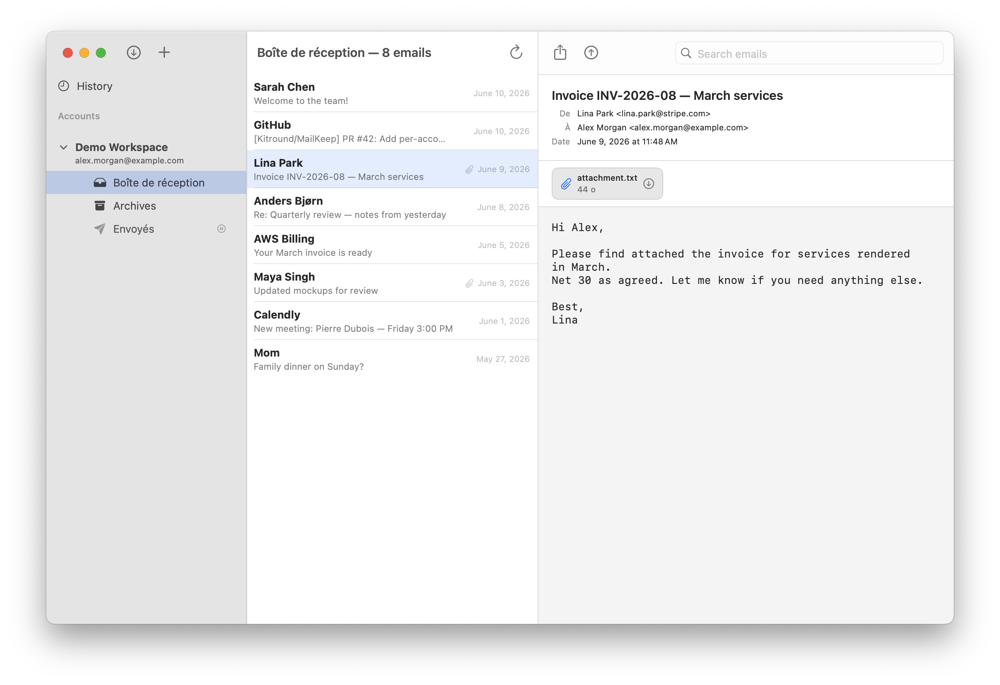

<p align="center">
  
</p>

<h1 align="center">MailKeep</h1>

<p align="center">
  A native macOS app to <strong>back up and restore IMAP mailboxes</strong> as standard <code>.mbox</code> files.<br>
  No dependency on Apple Mail, no third-party service.
</p>

<p align="center">
  
</p>

Direct IMAP/TLS connection on port 993, incremental backups, full local archive in an open format you actually own.

---

## Features

- **Direct IMAP backup** over TLS (port 993). Works with Gmail, iCloud, Fastmail, Proton Bridge, self-hosted Dovecot/Cyrus, etc.
- **Incremental sync** based on `UIDVALIDITY` + per-folder UID tracking. Re-runs only download new messages.
- **Configurable message filter** per account: All / Read only / Unread only / Flagged.
- **Open archive format**: Unix `.mbox` files split by year-month, plus a sidecar JSON index for fast browsing.
- **Built-in viewer**: read backed-up emails directly inside the app (HTML rendering, attachments listed).
- **Restore** entire folders or individual messages back to any IMAP server, original `INTERNALDATE` preserved.
- **Import** existing `.mbox` files from Apple Mail / Thunderbird / other backups.
- **Scheduled backups** per account (15 min → 7 days).
- **Menu-bar companion** with quick backup status.
- **Passwords stored in the macOS Keychain**, never in plaintext.
- **App Sandbox** enabled, minimal entitlements (network client + user-selected files only).
- **Read-only on the server**: backup uses `BODY.PEEK[]` and never sets the `\Seen` flag.

---

## Installation

1. Download the latest **`MailKeep.zip`** from the [Releases page](https://github.com/Kitround/MailKeep/releases).
2. Unzip and move `MailKeep.app` into `/Applications`.
3. First launch: right-click → **Open** to bypass Gatekeeper (the app is not yet notarised).
4. Pick a backup folder when prompted — this is where `.mbox` files will be written.

## Quick start

1. **Add an account** — server, username, password. Click **Test connection**.
2. **Pick folders** to back up (INBOX, Sent, Archives…).
3. **Choose what to back up** — by default only read messages are saved; switch to *All* if you want everything.
4. Hit **Back up all** (`⌘⇧B`) and watch the per-folder progress.
5. Optional: enable **scheduled backups** to run every N minutes/hours.

## Where your data lives

| What | Where |
|---|---|
| Mailboxes (`.mbox` files, one per year-month) | The folder you picked at first launch |
| Search index (JSON, per folder) | Same folder, next to the `.mbox` |
| UID state (per folder) | `~/Library/Containers/com.mailkeep.MailKeep/Data/Library/Application Support/` |
| IMAP passwords | macOS Keychain (service `com.mailkeep.MailKeep.imap`) |

The `.mbox` files use the standard Unix format with `From ` line escaping. You can open them with any mbox-aware tool (Apple Mail Import, Thunderbird, `mbox-parser`, scripts…).

## Restore

- **Full folder**: pick a `.mbox` file and a destination folder on the server. `INTERNALDATE` is preserved from the original `From ` line.
- **Single message**: open it in the viewer and use *Restore*.

Restored messages arrive flagged `\Seen` (server-side limitation: original flags are not stored in mbox).

---

## How incremental backup works

1. `SELECT` the folder, read `UIDVALIDITY` and `UIDNEXT`.
2. If `UIDVALIDITY` changed → wipe local state for that folder.
3. Run `UID SEARCH <filter>` (e.g. `SEEN`) — server returns the full UID list matching the filter.
4. Subtract the UIDs already on disk → fetch only the new ones.
5. Each message is appended to the right `.mbox` file (`<folder>_YYYY-MM.mbox`), indexed, and its UID added to local state.
6. Flushes happen every 50 messages so an interrupted run resumes cleanly.

`UID FETCH` uses `BODY.PEEK[]`, so the `\Seen` flag is never changed on the server.

---

## Build from source

Requirements:
- macOS 14 SDK or newer
- Xcode 15+
- Swift 5.9+

```bash
git clone https://github.com/Kitround/MailKeep.git
cd MailKeep
open MailKeep.xcodeproj
```

Then `⌘R` to build & run. No external dependencies, no package manager — pure SwiftUI + Foundation + Network framework.

---

## Project layout

```
MailKeep/
├── Engine/        Backup orchestrator + scheduler
├── IMAP/          Low-level IMAP client (TLS via NWConnection)
├── Models/        IMAPAccount, AppState, BackupRun, EmailMessage…
├── Storage/       Mbox read/write, JSON index, Keychain, state files
└── Views/         SwiftUI views (sidebar, list, detail, settings…)
```

See [`CLAUDE.md`](CLAUDE.md) for the full architectural notes.

---

## License

MIT — see [LICENSE](LICENSE).

## Contributing

Issues and PRs welcome. Please keep changes focused and explain *why* in the description.
